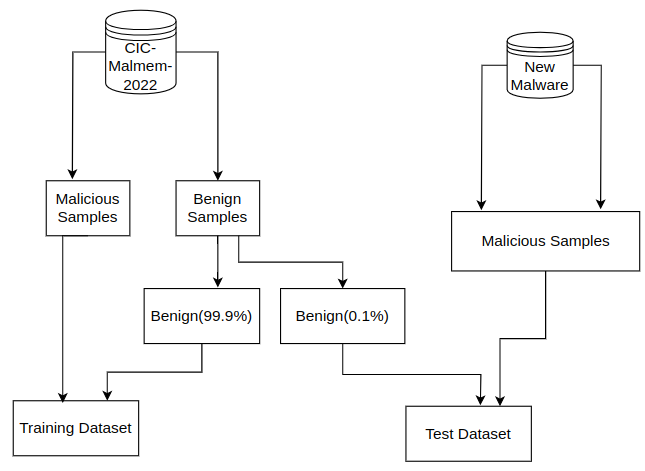

## About the Project
The primary objective of this project was to construct a malware detection system using machine learning and deep learning techniques, employing the CICMalmem datasets to effectively identify memory-obfuscated malwares. Additionally, we sought to assess the resilience of the top-performing model against evasion attacks and gauge its robustness. The datasets, referred to as CIC-Malmem2022, were sourced from the Canadian Institute of Cybersecurity's open-access website. These datasets were specifically curated for memory-obfuscated malwares, with the overarching research objective being to leverage machine learning and deep learning methodologies for the detection of previously unseen, unknown malwares that the model has not been trained on. Following the development and performance assessment of the model, adversarial attacks were executed to evaluate its robustness.

## Methodology
### Data Generation 
The purpose of generating additional data is to assess the performance of the model when exposed to unfamiliar malware. The original dataset, sourced from the CIC website, was primarily focused on trojans, spyware, and ransomware. To expand the diversity of malware types in our dataset, we gathered samples from various other categories, such as botnets, advanced persistent threats (APTs), keyloggers, and more. We then established a virtual environment and executed each malware sample within it, capturing memory dumps using FTK Imager software. Subsequently, we employed a tool called "volmemlyzer" to analyze these memory dump images, extracting relevant features and associated data for further examination.

### Training & Test Dataset creation
The following architectural approach was adopted to construct our datasets. In preparation for evaluating our best-performing model, we produced two separate test datasets. Primarily, our generation of malware samples involved oversampling utilizing two techniques, specifically SMOTE and random sampling. To maintain class balance, we incorporated benign samples from the CIC-malmem-2022 dataset and integrated our oversampled malware samples into the two designated test datasets. 

### Model Building and Evasion Attack
We have experimented the below machine learning and deep learning models

Machine learning models 
* Decision tree
* Random Forest
* LGBM
* Naive Bayes 

Deep Learning Model
* ANN (Artificial Neural Network)
* CNN (Convolutional Neural Network)

Adversarial Attack/ Evasion Attack
* FGSM (Fast Gradient Sign Method)
* JSMA (Jacobian Saliency Map Attack)

### References
* Tristan Carrier, Princy Victor, Ali Tekeoglu, Arash Habibi Lashkari,” Detecting Obfuscated Malware using Memory Feature Engineering”, The 8th International Conference on Information Systems Security and Privacy (ICISSP), 2022

* https://github.com/ahlashkari/VolMemLyzer
* https://stackoverflow.com/questions/58638406/superviseddbnclassification-object-has-no-attribute-classes
* https://www.unb.ca/cic/datasets/malmem-2022.html
